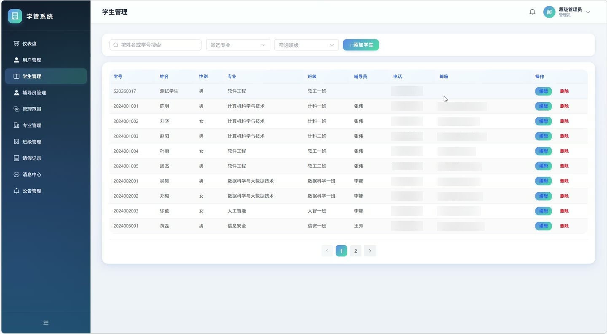

# (附文档)Springboot2+Vue3+MySQL 学生信息管理系统

**技术栈**：Springboot2、Vue3、MySQL

### 系统简介

本系统是一套基于 SpringBoot2 + Vue3 + MySQL 的前后端分离学生信息管理系统。系统内置管理员、辅导员、学生三种角色，覆盖学生档案管理、请假审批、消息通知、专业班级维护等核心业务场景。管理员可统筹全局数据，辅导员负责所辖学生管理，学生可在线提交请假与接收通知，各角色间通过消息模块实现站内沟通。
 
### 核心功能
 
### 普通用户端

- 账号注册：填写用户名、密码、姓名、角色（学生/辅导员）、性别、手机、邮箱，学生可选专业与班级，辅导员注册后需管理员审核方可登录

- 账号登录：输入用户名与密码进行身份验证，系统校验账号状态（正常/禁用/待审核），登录成功后返回 JWT 令牌及用户基本信息

- 个人信息维护：查看个人资料，修改真实姓名、手机号、邮箱；支持上传头像并更新头像地址；可修改登录密码（需验证原密码）

- 首页轮播图浏览：查看管理员发布的启用状态轮播图，按排序值升序展示

- 公告通知查看：浏览启用状态的公告列表，按排序值升序展示

- 专业与班级查询：查看所有专业列表，支持按专业筛选对应班级列表
 
### 学生端

- 学生档案查看：查看个人学号、姓名、性别、专业、班级、辅导员、联系电话、邮箱、家庭住址、入学日期等详细信息

- 请假申请提交：选择请假类型（病假/事假/其他），填写请假事由、开始时间、结束时间，提交后状态为待审批

- 请假记录查询：查看本人请假列表，可按状态（待审批/已批准/已拒绝/已撤销/已销假）筛选，展示审批意见与审批人

- 撤销请假：对待审批状态的请假单执行撤销操作，撤销后状态变为已撤销

- 销假操作：对已批准的请假单执行销假操作，销假后状态变为已销假

- 我的消息：查看收到的站内消息列表，支持标记单条已读、一键全部已读，显示未读消息数量

- 发送消息：向辅导员发送站内信，填写标题与内容后提交

- 我的仪表盘：查看个人请假总数、未读消息数，以及请假状态分布统计
 
### 辅导员端

- 学生列表查看：查看所管辖的学生列表，支持按姓名/学号关键字搜索，按专业、班级筛选，展示学生专业、班级、辅导员等完整信息

- 请假审批：查看所辖学生提交的请假申请列表，对待审批记录执行批准或拒绝操作，填写审批意见并记录审批时间

- 请假类型统计：查看所辖学生请假类型分布（病假/事假/其他）统计数据

- 消息管理：查看收到的消息与已发送消息，向所辖学生发送单条或批量站内信，标记已读与全部已读

- 学生通讯录：获取所辖学生用户列表，用于消息发送时选择收件人

- 我的仪表盘：查看所辖学生总数、待审批请假数、未读消息数
 
### 管理员端

- 用户管理：分页查询系统用户列表，支持按用户名/姓名关键字搜索、按角色筛选；可启用或禁用学生/辅导员账号，重置用户密码为123456，删除非管理员账号

- 学生管理：分页查询全部学生档案，支持按姓名/学号搜索、按专业/班级筛选；可新增学生（自动创建登录账号，初始密码123456）、编辑学生信息、删除学生（同步删除关联账号）

- 辅导员管理：分页查询辅导员列表，支持按姓名关键字搜索；可新增辅导员（自动创建登录账号，初始密码123456）、编辑辅导员信息（同步更新关联账号）、删除辅导员（同步删除账号及管辖范围）

- 管辖范围配置：查看辅导员管辖范围列表，支持单条添加、删除管辖记录，支持批量更新某辅导员的全部管辖专业与班级

- 专业管理：分页查询专业列表，支持按名称关键字搜索；可新增、编辑、删除专业

- 班级管理：分页查询班级列表，支持按名称搜索、按专业筛选；可新增、编辑、删除班级

- 请假总览：查看全部学生的请假记录列表，支持按状态筛选，展示所有请假详情

- 公告管理：维护公告与轮播图列表，支持按类型筛选；可新增、编辑、删除公告/轮播图，配置标题、内容、图片、状态与排序值

- 消息管理：查看全部站内消息，可向任意辅导员或学生发送站内信

- 数据统计仪表盘：查看学生总数、辅导员总数、用户总数、请假总数；按专业统计学生人数分布；按状态统计全部请假记录分布
 
### 技术栈

后端框架Spring Boot 2.x
ORM 框架MyBatis-Plus（含分页插件、逻辑删除、字段自动填充）
权限认证JWT（jjwt） + 自定义拦截器
密码加密Hutool MD5 加密
前端框架Vue 3（Composition API）
前端 UI 组件Element Plus
状态管理Vue Router + 本地存储（Token/用户信息）
构建工具Vite
数据库MySQL 8.x
文件上传本地磁盘存储（按日期分目录）
 
### 交付内容

- 后端完整源码

- 前端完整源码

- 数据库初始化脚本

- 万字文档

## 界面展示

---

## 获取完整源码 + 万字文档

本仓库为项目介绍页。**完整前后端源码、数据库初始化脚本、万字项目文档**，请加微信 `kangkangcode`，或访问 [codekk.top](http://codekk.top) 获取。

可作课程设计 / 毕业设计参考，支持远程部署调试。